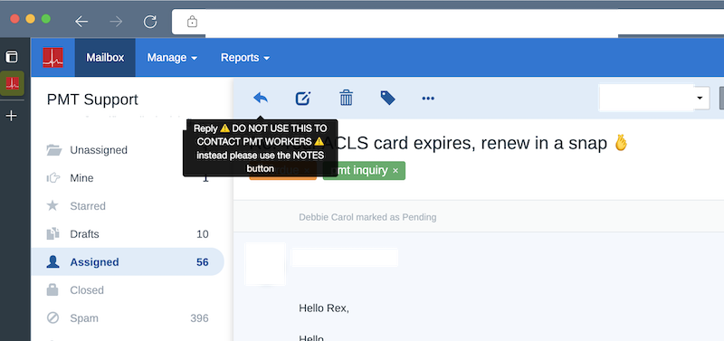

# FreeScout Dropkick JS

Dropkick JS adds a JavaScript snippet at the bottom of every page load.

We used it specifically to add a warning before somebody attempts to use the REPLY button if they were trying to contact one of our other support agents.

In this picture, a popup is added over the reply button that you can't miss.



## Use cases

- Add warnings/notices to parts of the UI that are specific to your company
- Prototype new features to add into FreeScout
- Quick productivity hacks

## Installation

These instructions assume you installed FreeScout using the [recommended process](https://github.com/freescout-helpdesk/freescout/wiki/Installation-Guide), the "one-click install" or the "interactive installation bash-script", and you are viewing this page using a macOS or Ubuntu system.

Other installations are possible, but not supported here.

1. Download the [latest release of FreeScout Dropkick JS](https://github.com/fulldecent/freescout-dropkick-js/releases).

2. Unzip the file locally.

3. Open DropkickJSServiceProvider.php using a code editor and change between the `<<<JS` and `JS` lines to remove my hack use case and add your own.

4. Copy the folder into your server using SFTP.

   ```sh
   scp -r ~/Desktop/freescout-dropkick-jsroot@freescout.example.com:/var/www/html/Modules/DropkickJS/
   ```

5. SSH into the server and update permissions on that folder.

   ```sh
   chown -R www-data:www-data /var/www/html/Modules/DropkickJS/
   ```

6. Access your admin modules page like https://freescout.example.com/modules/list.

7. Find **Dropkick JS** and click ACTIVATE.

8. Purchase a license code by sending USD 10 at https://www.paypal.com/paypalme/fulldecent/10usd

## Project scope

Our goal is to have a very simple module to allow vast extensibility in FreeScout.

Anything that makes it simpler (removes unneded code) or more extensible for most people will be a welcome improvement.

At this point, it is a non-goal to add friendly configuration of `<<<JS` or other configuration options.

## Inspiration

* This project was inspired by [Sidebar API](https://scoutdevs.com/downloads/sidebar-api/).
